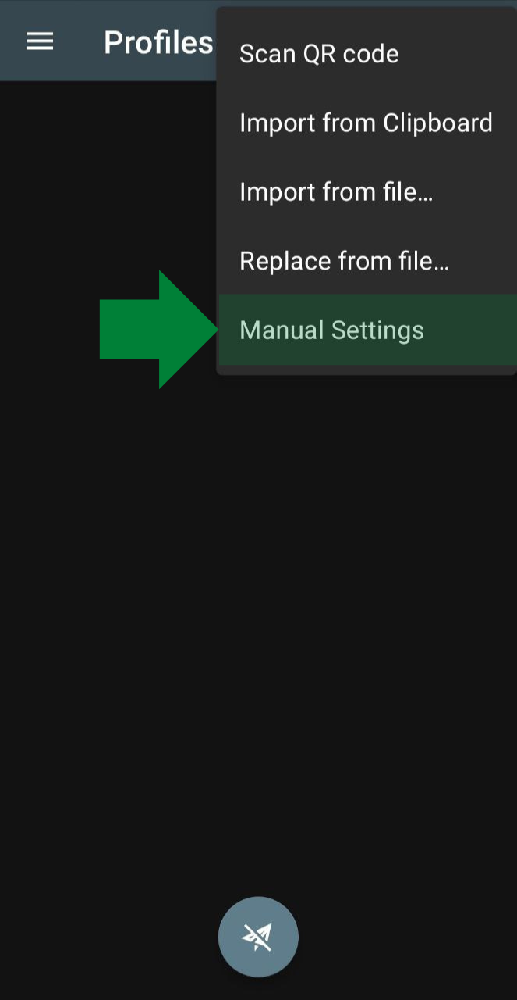
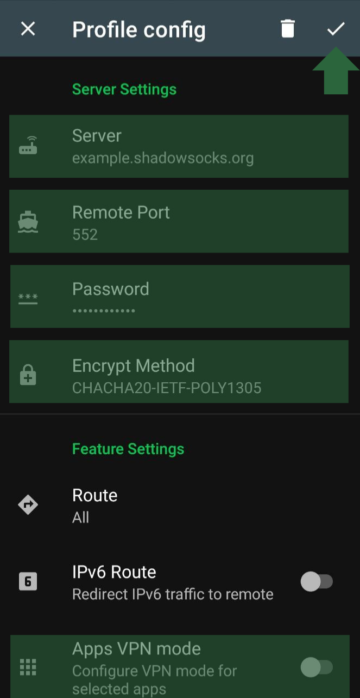
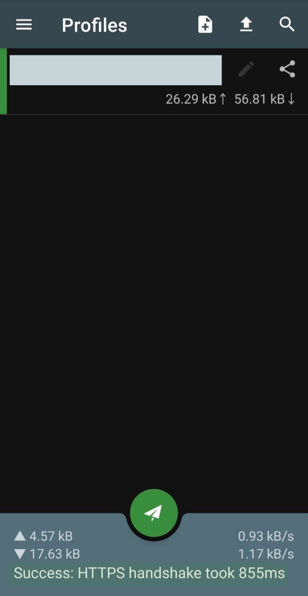

---
output:
  html_document: default
  pdf_document: default
---
# - شدوساکس

<!-- *Estimated time to complete: 60 minutes* -->

<!-- *Estimated saving time: A lot* -->

## سرفصل ها

- [معرفی شدوساکس](#معرفی-شدوساکس)
  - [برای راه اندازی شدوساکس به چه چیزی احتیاج دارم؟](#برای-راه-اندازی-شدوساکس-به-چه-چیزی-احتیاج-دارم)
  - [از کجا سرور تهیه کنم؟](#از-کجا-سرور-تهیه-کنم)
  - [حداقل مشخصات سرور مجازی برای راه اندازی سرویس شدوساکس چقدر است؟](#حداقل-مشخصات-سرور-مجازی-برای-راه-اندازی-سرویس-شدوساکس-چقدر-است)
  - [آیا حکومت از بیرون میتواند از نصب سرویس شدوساکس روی سرور شما باخبر شود؟](#آیا-حکومت-از-بیرون-میتواند-از-نصب-سرویس-شدوساکس-روی-سرور-شما-باخبر-شود)
  - [چرا این کتابچه را ایجاد کردیم؟](#چرا-این-کتابچه-را-ایجاد-کردیم)
  - [توصیه شما برای ایجاد بستری امن برای استفاده آزاد از اینترنت چیست؟](#توصیه-شما-برای-ایجاد-بستری-امن-برای-استفاده-آزاد-از-اینترنت-چیست)
- [راه اندازی سرور شدوساکس](#راه-اندازی-سرور-شدوساکس)
  - [راه اندازی سرور شدوساکس روی لینوکس](#راه-اندازی-سرور-شدوساکس-روی-لینوکس)
  - [راه اندازی سرور شدوساکس روی ویندوز](#راه-اندازی-سرور-شدوساکس-روی-ویندوز)
- [راه اندازی کلاینت شدوساکس](#راه-اندازی-کلاینت-شدوساکس)
  - [استفاده از شدوساکس در کلاینت اندروید](#استفاده-از-شدوساکس-در-کلاینت-اندروید)

## معرفی شدوساکس 

شدوساکس (به انگلیسی: Shadowsocks) یک پروکسی رمزگذاری شده با منبع آزاد و متن باز است که به‌طور گسترده در سرزمین اصلی چین برای جلوگیری از سانسور اینترنت استفاده می‌شود. این برنامه در سال ۲۰۱۲ توسط برنامه‌نویس ناشناس چینی به نام مستعار "clowwindy" ساخته شد و از آن زمان تا کنون چندین مرحله پیاده‌سازی پروتکل آن در دسترس قرار گرفته‌است. به‌طور معمول، نرم‌افزار کلاینت یک پروکسی socks5 را بر روی دستگاهی که در حال اجرا است باز می‌کند، که پس از آن ترافیک اینترنتی همانند تونل SSH به آن سمت هدایت می‌شود. بر خلاف یک تونل SSH، شدوساکس می‌تواند ترافیک UDP را نیز پروکسی کند.

### برای راه اندازی شدوساکس به چه چیزی احتیاج دارم؟ 

برای راه اندازی شدوساکس به عنوان سرویس دهنده شما احتیاج به یک سرور مجازی لینوکس یا ویندوز خارج از ایران دارید که دارای آی پی ثابت باشد. 

 

> برای اطلاعات بیشتر در مورد پشتیبانی از سیستم عامل ها و زبان های برنامه نویسی میتوانید به گیت هاب رسمی شدوساکس مراجعه کنید. [(گیت هاب رسمی شدوساکس)](https://github.com/shadowsocks)

 

<i>وبسایت رسمی شدوساکس <a href="https://shadowsocks.org/">https://shadowsocks.org/</a></i>

 

### از کجا سرور تهیه کنم 

ما نمیتوانیم سرویس دهنده مشخصی به شما معرفی کنیم. درکل فرقی نمیکند از کدام سرویس دهنده ایرانی یا خارجی اقدام به خریداری سرور میکنید. فقط مطمین شوید که سرویس دهنده به حریم خصوصی شما احترام میگذارد.
 
 

### حداقل مشخصات سرور مجازی برای راه اندازی سرویس شدوساکس چقدر است 

حداقل مشخصات لازم برای راه اندازی سرویس شدوساکس..
 
 

### آیا حکومت از بیرون میتواند از نصب سرویس شدوساکس روی سرور شما باخبر شود؟ 

به طور معمول خیر. ولی مطمین شوید جهت استفاده از سرویس اطلاعات اتصال کلاینت را با افراد مطمین به اشتراک میگذارید. چرا که آی پی سرور شما در مشخصات اتصال وجود دارد.

 

### چرا این کتابچه را ایجاد کردیم؟ 

با توجه به گسترش سانسور اینترنت توسط دولت جمهوری اسلامی و ایجاد بستر ویژه برای از کار انداختن فیلترشکن های عمومی این کتابچه را ایجاد کردیم.

 

### توصیه شما برای ایجاد بستری امن برای استفاده آزاد از اینترنت چیست؟ 

با توجه به سخت گیرانه شدن فیلترینگ و از کارافتادن راه کارهای عمومی عبور از فیلتر توصیه میشود با استفاده از سرورهای شخصی بصورت گروهی اقدام به راه اندازی سرورهای شدوساکس کنید. با اینکه اجاره سرور مجازی بصورت ماهانه هزینه زیادی در بر دارد ولی میتوانید هزینه اجاره سرور را مثلا بین ۴۰ نفر از افرادی که میشناسید تقسیم کنید و بصورت اشتراکی از سرویس استفاده کنید و به این شکل هزینه ماهانه اجاره سرور را به حداقل ممکن
 برسانید.

 

## راه اندازی سرور شدوساکس 

### راه اندازی سرور شدوساکس روی لینوکس  

بعد از خرید سرور مجازی لینوکس ابونتو سرور یا سنت او اس با استفاده از ssh یا با استفاده از روش های دیگر به کنسول سرور متصل شوید.

بجای [root] یوزرنیم و بجای [your-server-ip] آی پی سرور را وارد نمایید.

>
ssh [root]@[your-server-ip]

>
مثال: ssh root@98.2.1.3

اگر با یوزری غیر از root وارد شده اید با استفاده از دستور زیر دسترسی خود را به root ارتقاع دهید
نکته: بعد از وارد کردن دستور زیر از شما پسورد درخواست میشود لذا آن را وارد نمایید.

>
sudo su

برای نصب بسته شدوساکس ابتدا لیست بسته های apt را آپدیت کنید:

>
apt-get update

معادل دستور بالا برای لینوکس centOS:

>
yum update

سپس با دستور زیر بسته shadowsocks-libev را نصب کنید:

>
yes | apt-get install shadowsocks-libev
  

معادل دستور بالا برای لینوکس centOS:

>
yum install shadowsocks-libev

سپس با استفاده از vim یا nano فایل پیکربندی شدوساکس را باز کنید:

>
nano /etc/shadowsocks-libev/config.json
  

فایل پیکربندی دارای مقادیر پیشفرض شبیه به پیکربندی زیر است:

>

{ 
  "server":["::1", "127.0.0.1"], 
  "mode":"tcp_and_udp", 
  "server_port":8388, 
  "local_port":1080, 
  "password":"WJciim7ok@rmw", 
  "timeout":60, 
  "method":"chacha20-ietf-poly1305"
}

  

مقادیر پیکربندی را به مقادیر زیر تغیر دهید:

>

    "server":["::1", "0.0.0.0"], 
    "mode":"tcp_and_udp", 
    "server_port":552, 
    "local_port":1080, 
    "password":"6VWJciim7ok@rmwC#ZZY8w", 
    "timeout":60, 
    "method":"chacha20-ietf-poly1305"
}

توجه داشته باشید که در بخش server_port یک پورت آزاد در سیستم را انتخاب کنید که سرویسی بر روی آن درحال اجرا نباشد.
در بخش password یک کلمه عبور قوی برای اتصال به سرور انتخاب کنید
در بخش method میتوانید روش رمزنگاری ارتباط را انتخاب کنید. بطور پیشفرض بر روی chacha20-ietf-poly1305 تنظیم شده است ولی رمزنگاری های زیر قابل انتخاب هستند:

>

"aes-256-cfb" 
"aes-128-cfb" 
"chacha20" 
"chacha20-ietf" 
"aes-256-gcm" 
"aes-128-gcm" 
"chacha20-poly1305" or "chacha20-ietf-poly1305"

بعد از ذخیره فایل باید پورتی که در فایل پیکربندی انتخاب کرده اید را روی سیستم باز کنید.
برای اینکار ابتدا بررسی کنید چه سیستم فایروالی بر روی سیستم شما در حال اجرا است. معمولا بصورت پیشفرض برای ابونتو سرور فایروال ufw فعال است.
در بعضی مواقع سرویس firewalld برای سیستم تعبیه شده است برای اطمینان میتوانید دستور زیر را وارد کنید:

>
systemctl status ufw

>
systemctl status firewalld

هر کدام از وضعیت های سرویس های بالا به رنگ سبز بود به معنی فعال بودن آن است:

>Active: active (running) 

بعد از بررسی نوع فایرفال سیستم برای باز کردن پورت udp/tcp 552 در فایروال ufw از دستور زیر استفاده کنید:
 

>
ufw allow 552

 
برای باز کردن پورت 552 udp/tcp در فایروال firewalld از دستورهای زیر استفاده کنید:

>
firewall-cmd --permanent --add-port=552/tcp

firewall-cmd --permanent --add-port=552/udp

 

برای فعالسازی سرویس شدوساکس و اجرای خودکار آن در هنگام شروع سیستم عامل دستورات زیر را اجرا کنید:

>
systemctl restart shadowsocks-libev

systemctl enable shadowsocks-libev

 

برای مشاهده وضعیت سرویس شدوساکس از دستور زیر استفاده کنید:

>
systemctl status shadowsocks-libev

 

اگر وضعیت سرویس در حالت active (running) و به رنگ سبز باشد یعنی سرویس با موفقیت نصب شده است و درحال اجرا است

>Active: active (running) 

تبریک! سرویس شدوساکس آماده استفاده میباشد. برای استفاده از آن به قسمت آموزش استفاده در کلاینت های مختلف بروید.

## راه اندازی کلاینت شدوساکس 

### استفاده از شدوساکس در کلاینت اندروید 

برای استفاده از شدوساکس در کلاینت اندروید کلاینت رسمی آن را از گوگل پلی بر روی گوشی خود نصب کنید:

بعد از نصب و اجرای برنامه همانند تصویر بر روی Manual Settings کلیک کنید

سپس در صفحه ی باز شده اطلاعات سرور را همانند فایل کانفیگ موجود در /etc/shadowsocks-libev/config.json وارد کنید و بر روی تیک تایید کلیک کنید:

توجه کنید در قسمت Server باید آی پی سرور خود را وارد کنید.
اگر لازم دارید که فقط بخشی از برنامه های شما از شدوساکس استفاده کنند تیک گذینه Apps VPN Mode را زده و از لیست برنامه ها برنامه های مورد نظر خود را انتخاب کنید. در غیر اینصورت برای استفاده از شدوساکس برای تمام برنامه ها این تیک را همانند تصویر بردارید.

بعد از ذخیره و کلیک بر روی اتصال میتوانید ارتباط خود را تست کنید:

 